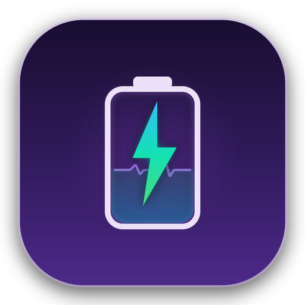
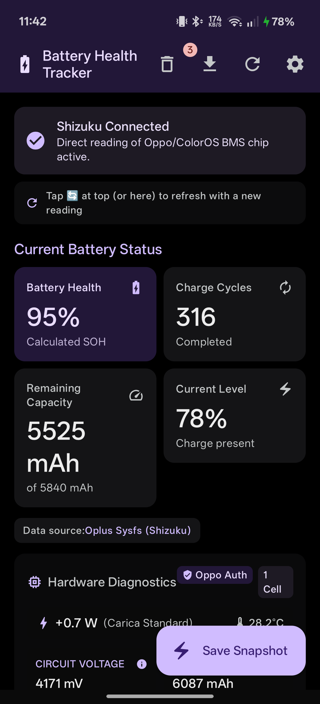
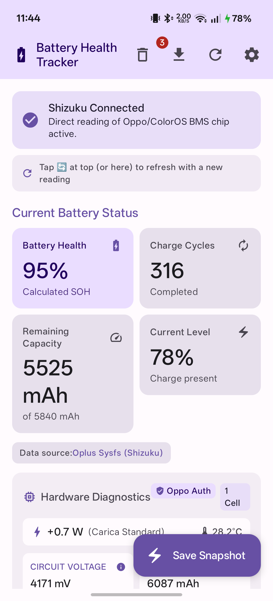
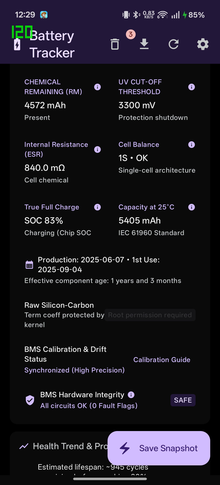
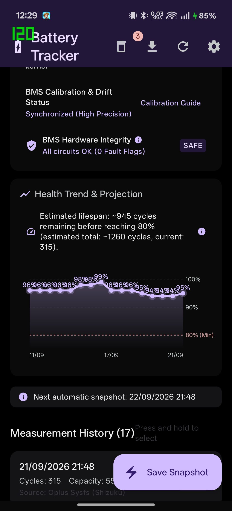
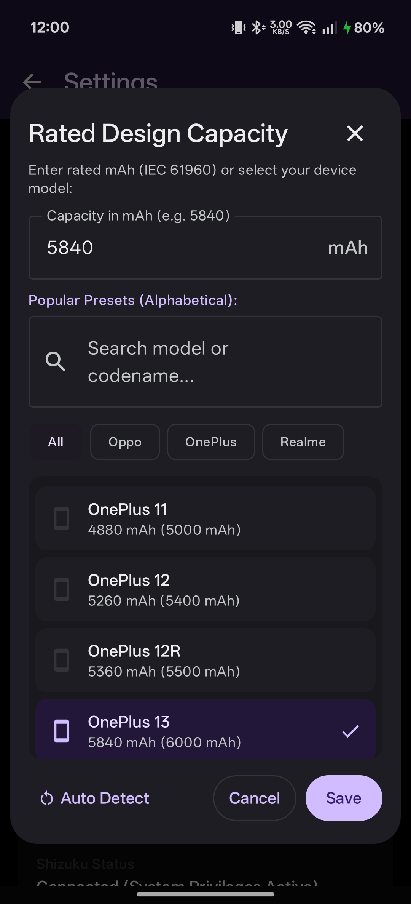
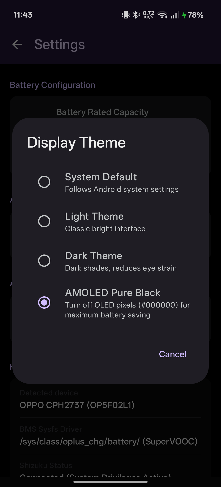
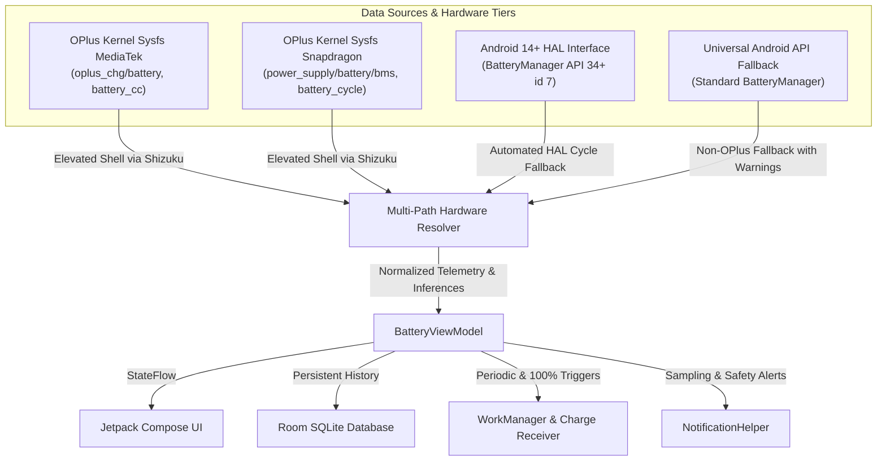

<p align="center">
  
</p>

<h1 align="center">Battery Health Tracker (Oplus Edition)</h1>

<p align="center">
  <b>Advanced hardware-level battery health, BMS telemetry, and degradation tracker for Oppo, OnePlus, and Realme devices. Powered by Shizuku.</b>
</p>

<p align="center">
  <a href="https://github.com/RikkaApps/Shizuku"></a>
  
  
  
  
  
  
</p>

---

## 📌 Overview

On modern Android devices—particularly within the **Oplus ecosystem (Oppo, OnePlus, Realme / ColorOS, OxygenOS, Realme UI)**—the operating system restricts and abstracts critical battery metrics. Standard Android battery APIs typically return coarse percentage estimates, rounded cycle counts, or hidden health statistics.

**Battery Health Tracker** bridges this gap. By utilizing **[Shizuku](https://shizuku.rikka.app/)** to execute elevated unprivileged shell transactions (no root required), the app directly interrogates the kernel Battery Management System (BMS) hardware nodes (`/sys/class/oplus_chg/battery/` and `/sys/class/power_supply/battery/`).

This delivers accurate, real-time electrochemical diagnostic data: true State of Health (SOH), cycle counts, internal cell resistance (ESR), cell temperature, thermal capacity compensation (**IEC 61960**), charging IC safety fault registers, and live wattage.

---

## 📸 Screenshots

<table align="center">
  <tr>
    <td align="center" width="33%"><b>AMOLED Pure Black</b></td>
    <td align="center" width="33%"><b>Light Theme</b></td>
    <td align="center" width="33%"><b>Hardware Diagnostics</b></td>
  </tr>
  <tr>
    <td></td>
    <td></td>
    <td></td>
  </tr>
  <tr>
    <td align="center" width="33%"><b>Health Trend & Projection</b></td>
    <td align="center" width="33%"><b>Device Presets & Rated mAh</b></td>
    <td align="center" width="33%"><b>Theme Settings</b></td>
  </tr>
  <tr>
    <td></td>
    <td></td>
    <td></td>
  </tr>
</table>

---

## ✨ Key Features

### 🔬 Low-Level BMS & Kernel Telemetry (via Shizuku)
- **Direct Fuel Gauge Interrogation:** Reads physical register values directly from `/sys/class/oplus_chg/battery/` and `/sys/class/power_supply/battery/`.
- **True State of Health (SOH):** Real electrochemical capacity measured against calibrated nominal factory design capacity.
- **Accurate Cycle Counter:** Reads cumulative charge cycles tracked by the physical fuel gauge IC rather than software battery stats resets.
- **Coulomb Counter Integration & BMS Drift Detection:** Tracks synchronization health between the battery management IC and open-circuit voltage (OCV) curves to guide calibration when partial charges cause measurement drift.

### ⚡ True Full Charge vs Display 100%
- **Constant Current (CC) vs Constant Voltage (CV) Tracking:** Detects whether Android's display "100%" is merely the end of the CC phase (~88%–92% chemical saturation) or whether the battery has reached **True Full Saturation** through CV tapering ($I_{\text{now}} \le 80\text{ mA}$).
- Direct raw monitoring of the `/sys/class/oplus_chg/battery/chip_soc` register.

### 🌡️ IEC 61960 Thermal Compensation
- **Normalized Capacity at 25°C:** Normalizes measured full-charge capacity against ambient and battery temperature variations using the international electrochemical standard:
  $$C_{25^\circ\text{C}} = \frac{C_{\text{fcc}}}{1.0 + 0.006 \times (T_{\text{batt}} - 25.0)}$$
- Eliminates seasonal fluctuations (e.g., apparent lower capacity in winter at 15°C vs higher in summer at 35°C), providing an objective indicator of true molecular cell wear.

### 🛡️ BMS Safety & Hardware Protection Registers
- **Silicon-Level Health Monitoring:** Inspects physical protection flags in real time:
  - `short_c_hw_status`: Short-circuit detection across power stages.
  - `short_ic_otp_status`: Hardware over-temperature protection (OTP) of the charge controller.
  - `subboard_temp_err`: Integrity and health of the USB-C sub-board thermal sensors.
- Displays an instant security badge (**SAFE** vs **ALERT**) to verify charging subsystem integrity.

### 📈 Internal Resistance (ESR) & Cell Impedance
- Estimates real-time internal resistance ($\text{m}\Omega$) based on instantaneous $\frac{\Delta V}{I}$ under active discharge and charge loads.
- Educates the user regarding normal electrochemical polarization overpotentials during high-speed SuperVOOC charging.

### 📊 Health History, Projection & Charts
- **Smooth Canvas Trend Visualization:** Interactive linear chart tracking SOH over time with reference lines at 100%, 90%, and the critical 80% industrial battery replacement threshold.
- **Cycle Life Projection:** Estimates remaining charge cycles before reaching 80% capacity based on the user's historical degradation rate.
- **Safe History Management:** Multi-selection deletion, persistent Trash bin, full restoration, and JSON/CSV export.

### 🔔 Smart Snapshot Notifications & Thermal Safety Alerts
- **Sampling Confirmation Notifications:** Provides instant on-device notification cards whenever a measurement is captured:
  - **Manual Snapshots:** Direct feedback confirming newly saved records via the in-app *"Save Snapshot"* action.
  - **Automatic Periodic Sampling:** Background logging executed every 24 hours via Android `WorkManager`.
  - **100% Full-Charge Disconnect:** Automatic sampling triggered immediately when the charger is unplugged after reaching full saturation.
  - Each notification neatly summarizes updated SOH %, cumulative charge cycles, residual capacity (mAh), and the active telemetry data source.
- **Hardware Overheat Protection Alert:** High-priority warning triggered if the battery cell temperature exceeds the critical safety threshold (> 42°C) during high-speed SuperVOOC charging or heavy sustained workloads, advising the user to cool the device down and safeguarding battery chemistry against accelerated degradation.

### 🚀 120 Hz Native Fluidity & Battery-Saving Design
- **Ultra-Fluid UI:** Fully optimized for high-refresh-rate displays (120 Hz) with zero-allocation composables, stable keys, and strict 8.33 ms frame budget compliance.
- **Color-Matched System Bars:** Status bar and navigation bar seamlessly blend with the application header banner for a professional, unified aesthetic.
- **Four Display Theme Modes:**
  1. **System Default:** Follows OS-level light/dark configuration.
  2. **Light Theme:** Classic, clean Material 3 design.
  3. **Dark Theme:** Balanced dark tones designed to reduce eye strain in low-light environments.
  4. **AMOLED Pure Black (`#000000`):** Turns off OLED sub-pixels completely, eliminating screen power draw across background regions.

### 🌐 Multilingual
- Fully localized in **English**, **Italian (Italiano)**, and **Spanish (Español)**.

---

## 📱 Verified Device Battery Database & Hardware Compatibility

> [!NOTE]
> The table below catalogues factory-verified battery specifications (nominal rated capacity according to **IEC 61960** and typical capacity) embedded directly within the application's auto-detection preset engine.  
> **Important Hardware Clarification:** While low-level sysfs structures are standardized across the ColorOS, OxygenOS, and Realme UI codebases, physical sysfs node paths, SELinux policies, and fuel gauge drivers can vary based on regional variants, minor carrier updates, or custom ROMs. As such, real-world hardware reading capability cannot be 100% guaranteed on every unverified build. Community feedback, testing, and reports via [GitHub Issues](https://github.com/FrancescoMin/batteryhealthtracker/issues) are warmly encouraged!

| Manufacturer | Model Series | Battery Architecture | Typical / Rated Capacity |
| :--- | :--- | :--- | :--- |
| **OnePlus** | OnePlus 15 | Serial Dual-Cell | 7300 mAh (2×3650) / 7150 mAh (2×3575) |
| **OnePlus** | OnePlus 13 / 13R | Silicon-Carbon Dual-Cell | 6000 mAh / 5840 mAh |
| **OnePlus** | OnePlus 12 / 12R | Dual-Cell Serial | 5400–5500 mAh / 5260–5360 mAh |
| **OnePlus** | OnePlus 11 / 10 Pro | Dual-Cell Serial | 5000 mAh / 4880 mAh |
| **OnePlus** | Nord 5 (Global & India)* | High-Capacity Dual-Cell | 6800 mAh / 6650 mAh |
| **OnePlus** | Nord 5 (EU/UK)* | Dual-Cell Serial | 5200 mAh / 5200 mAh |
| **OnePlus** | Nord 4 / CE 4 / CE 4 Lite | Dual-Cell Serial | 5500 mAh / 5360 mAh |
| **OnePlus** | Nord 3 | Dual-Cell Serial | 5000 mAh / 4880 mAh |
| **OnePlus** | OnePlus Open | Dual-Cell Foldable | 4805 mAh / 4680 mAh |
| **Realme** | GT 8 Pro | Dual-Cell Serial | 7000 mAh (2×3500) / 6850 mAh (2×3425) |
| **Realme** | GT 7 Pro (Global/EU/CN) | Dual-Cell Serial | 6500 mAh (2×3250) / 6310 mAh (2×3155) |
| **Realme** | GT 7 Pro (India) | Dual-Cell Serial | 5800 mAh / 5660 mAh |
| **Realme** | GT 6 / GT 6T / GT 5 Pro | Dual-Cell Serial | 5400–5500 mAh / 5260–5360 mAh |
| **Realme** | 14 Pro+ | Silicon-Carbon Single-Cell | 6000 mAh / 5850 mAh |
| **Realme** | 13 Pro+ | High-Density Single-Cell | 5200 mAh / 5050 mAh |
| **Realme** | 12 Pro+ | High-Density Single-Cell | 5000 mAh / 4880 mAh |
| **Oppo** | Find X9 Pro | Silicon-Carbon Dual-Cell | 7500 mAh / 7290 mAh (28.13 Wh / 27.34 Wh) |
| **Oppo** | Find X9 | Silicon-Carbon Dual-Cell | 7025 mAh / 6840 mAh (26.35 Wh / 25.65 Wh) |
| **Oppo** | Find X8 / X8 Pro | Silicon-Carbon Dual-Cell | 5630–5910 mAh (Typical) |
| **Oppo** | Find X7 / X7 Ultra | Dual-Cell Serial | 5000 mAh / 4860–4880 mAh |
| **Oppo** | Reno 16 (Global/EU) | High-Density Single-Cell | 6000 mAh / 5820 mAh (22.5 Wh / 21.83 Wh) |
| **Oppo** | Reno 16 (China) | Silicon-Carbon | 6700 mAh / 6490 mAh |
| **Oppo** | Reno 15 / 15 Pro | High-Density Single-Cell | 6200–6500 mAh / 6040–6335 mAh |
| **Oppo** | Reno 14 / 14 Pro | High-Density Single-Cell | 6000–6200 mAh / 5840–6060 mAh |
| **Oppo** | Reno 10 Pro / 11 Pro | Dual-Cell Serial | 4600 mAh / 4440 mAh |

*Manual rated capacity override is also supported in Settings for custom or unlisted models.*

> [!NOTE]
> \* **OnePlus Nord 5 Root Requirement:** On the OnePlus Nord 5 (CPH2707 / Snapdragon 8s Gen 3), OxygenOS SELinux policies strictly isolate Qualcomm battery sysfs nodes from standard shell access (Shizuku). Direct hardware BMS readings on this model require **Root (`su`) permissions**.

---

## 🛠️ How It Works (Technical Architecture)



### Multi-Tiered Hardware Resolution & Fallback Strategy

The application employs an intelligent multi-tiered pipeline that dynamically adapts to device vendors, kernel architectures, and processor families:

1. **Tier 1: Direct OPlus Kernel Sysfs (Oppo, OnePlus, Realme via Shizuku)**
   - **Processor Family Adaptation (Qualcomm Snapdragon vs. MediaTek Dimensity):**
     - On **MediaTek** platforms (e.g. Dimensity 7300/8300/9400), cumulative charge cycles are registered under `/sys/class/oplus_chg/battery/battery_cc`.
     - On **Qualcomm Snapdragon** platforms (e.g. Snapdragon 7+ Gen 3, 8 Gen 2/3/4), the kernel exposes cycle counts and power metrics under `battery_cycle`, `cycle_count`, `/sys/class/power_supply/battery/`, or `/sys/class/power_supply/bms/`.
     - A chained, low-overhead shell transaction (`querySysfs`) queries these candidates in priority order within a single Binder transaction, eliminating latency.
   - **Microampere ($\mu\text{Ah}$) Normalization:** Automatically recognizes and scales raw Qualcomm PMIC registers reporting in $\mu\text{Ah}$ ($> 100,000$) to standard milliampere-hours ($\text{mAh}$).
   - **Bidirectional SOH & FCC Inference:** If a custom firmware exposes the physical State of Health (SOH) register (e.g., 98%) but restricts the raw Full Charge Capacity node, the app mathematically deduces true residual capacity against the verified factory IEC rating ($\text{Rated} \times \frac{\text{SOH}}{100}$), and vice versa.

2. **Tier 2: Android 14+ Hardware HAL Fallback**
   - If low-level sysfs cycle count nodes are modified or restricted by manufacturer SELinux policies across minor firmware updates, the app automatically queries Android 14's hardware HAL (`BatteryManager.getIntProperty(7)`).
   - This ensures charge cycle counters remain fully operational on modern Android 14/15/16 devices even when custom sysfs files are unavailable.

3. **Tier 3: Universal Android BatteryManager Fallback (Samsung, Google Pixel, Xiaomi, etc.)**
   - When running on non-OPlus hardware or if Shizuku permissions are not granted, the app gracefully falls back to the standard Android `BatteryManager` API.
   - **Reliability Badges & Scientific Transparency:** Standard Android APIs only expose `BATTERY_PROPERTY_CHARGE_COUNTER`, which reflects the **instantaneous Coulomb counter** (current charge present in the cell based on SoC), not the degraded chemical maximum capacity. In fallback mode, the app displays prominent **red warning badges** and explanatory dialogs to ensure users are never misled into confusing instantaneous charge with battery wear.

---

## 📥 Installation & Setup

### Prerequisites
1. An **Oppo, OnePlus, or Realme** device running Android 14 or higher (or any Android 14+ device with standard BatteryManager support).
2. **Shizuku** installed and running:
   - Download Shizuku from [Google Play](https://play.google.com/store/apps/details?id=moe.shizuku.privileged.api) or [GitHub Releases](https://github.com/RikkaApps/Shizuku/releases).
   - Start Shizuku via **Wireless Debugging** (no computer required after initial setup) or via **Root** (if rooted).

### App Setup
1. Download the latest `BatteryHealthTracker-v1.2.apk` from the [Releases](https://github.com/FrancescoMin/batteryhealthtracker/releases) section.
2. Install the APK on your device.
3. Open **Battery Health Tracker**.
4. When prompted on Android 13+, allow the **Notification Permission** (`POST_NOTIFICATIONS`):
   - **Why it is requested:** Enables status receipts for manual snapshots and automated background logging (24-hour periodic cycles and 100% charger disconnects), as well as real-time overheat alerts (> 42°C).
5. Tap **"Authorize Shizuku"** and allow permission in the Shizuku prompt.
6. All hardware telemetry, health metrics, and BMS registers will immediately populate!

---

## 🔨 Building from Source

### Requirements
- **JDK 17** or **JDK 21**
- **Android SDK 34** (compileSdk 34)
- **Gradle 8.7+**

### Steps
1. Clone this repository:
   ```bash
   git clone https://github.com/FrancescoMin/batteryhealthtracker.git
   cd batteryhealthtracker
   ```
2. Build the debug APK using Gradle wrapper:
   ```bash
   # On Linux / macOS:
   ./gradlew assembleDebug

   # On Windows (PowerShell):
   .\gradlew.bat assembleDebug
   ```
3. Install directly to your connected device via ADB:
   ```bash
   adb install -r app/build/outputs/apk/debug/app-debug.apk
   ```

---

## 🔒 Privacy, Security & Permissions

- **100% Offline:** The app does not request or declare `android.permission.INTERNET`. Zero network calls, zero outbound packets, zero data leaves your device.
- **Transparent Notifications (`POST_NOTIFICATIONS`):** Used strictly for local on-device sampling receipts (manual captures, 24h background sampling, and 100% unplug events) and critical battery overheat alarms (> 42°C). Never used for marketing or background telemetry.
- **Zero Trackers / Telemetry:** No Google Analytics, Firebase, Crashlytics, or third-party advertising SDKs.
- **Local Storage Only:** Historical measurements are stored in a local on-device SQLite database via Android Room.
- **Open Source:** Full source code is open, auditable, and distributed under the Apache-2.0 License.

---

## 🤝 Contributing

Contributions, device profile additions, translations, and feature suggestions are welcome!

1. Fork the project.
2. Create your feature branch (`git checkout -b feature/NewDevicePreset`).
3. Commit your changes (`git commit -m "Add verified battery preset for Device X"`).
4. Push to the branch (`git push origin feature/NewDevicePreset`).
5. Open a Pull Request.

---

## 📄 License

Distributed under the **Apache License, Version 2.0**. See `LICENSE` for more information.

---

<p align="center">
  <sub>Built with ❤️ for Android enthusiasts, battery health purists, and the Shizuku community.</sub>
</p>