<p align="center">
  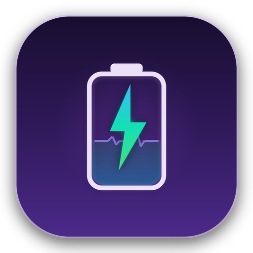
</p>

<h1 align="center">Battery Health Tracker (O+ - Oppo - Realme Edition)</h1>

<p align="center">
  <b>Advanced hardware-level battery health, BMS telemetry, and degradation tracker for Oppo, OnePlus, and Realme devices. Powered by Shizuku.</b>
</p>

<p align="center">
  <a href="https://github.com/RikkaApps/Shizuku"></a>
  
  
  
  
  
  <a href="https://github.com/FrancescoMin/batteryhealthtracker/actions/workflows/android.yml"></a>
  <a href="https://github.com/FrancescoMin/batteryhealthtracker/releases"></a>
</p>

---

## 📌 Overview

On modern Android devices—particularly within the **Oplus ecosystem (Oppo, OnePlus, Realme / ColorOS, OxygenOS, Realme UI)**—the operating system restricts and abstracts critical battery metrics. Standard Android battery APIs typically return coarse percentage estimates, rounded cycle counts, or hidden health statistics.

**Battery Health Tracker** bridges this gap. By utilizing **[Shizuku](https://shizuku.rikka.app/)** to execute elevated unprivileged shell transactions (no root required), the app directly interrogates the kernel Battery Management System (BMS) hardware nodes (`/sys/class/oplus_chg/battery/` and `/sys/class/power_supply/battery/`).

This delivers accurate, real-time electrochemical diagnostic data: true State of Health (SOH), cycle counts, internal cell resistance (ESR), cell temperature, thermal capacity compensation (**IEC 61960**), charging IC safety fault registers, and live wattage.

> [!NOTE]
> **🚀 Repository Development Status / Stato di Sviluppo della Repository:**  
> The codebase in the `main` branch may be ahead of the latest tagged GitHub Release (`BatteryHealthTracker-v1.8.apk`). New features, hardware presets, and optimizations currently undergoing testing in the repository will be bundled and published in future release APKs.  
> *Il codice presente nella repository (`main`) potrebbe risultare più avanzato rispetto all'ultima release ufficiale scaricabile, poiché alcune nuove funzioni o migliorie sono ancora in fase di testing e confluiranno nelle release successive.*

---

## 📸 Screenshots

<table align="center">
  <tr>
    <td align="center" width="33%"><b>AMOLED Pure Black</b></td>
    <td align="center" width="33%"><b>Light Theme</b></td>
    <td align="center" width="33%"><b>Hardware Diagnostics</b></td>
  </tr>
  <tr>
    <td>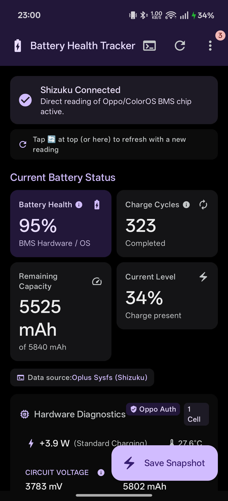</td>
    <td>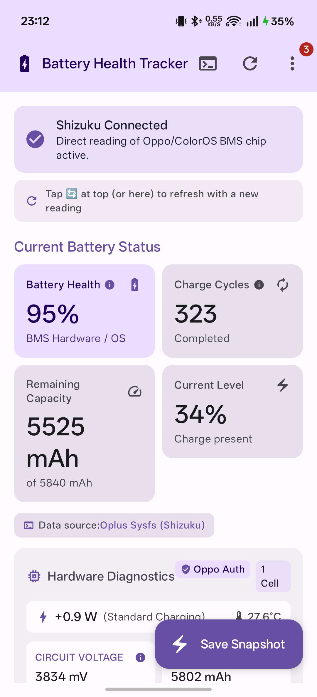</td>
    <td>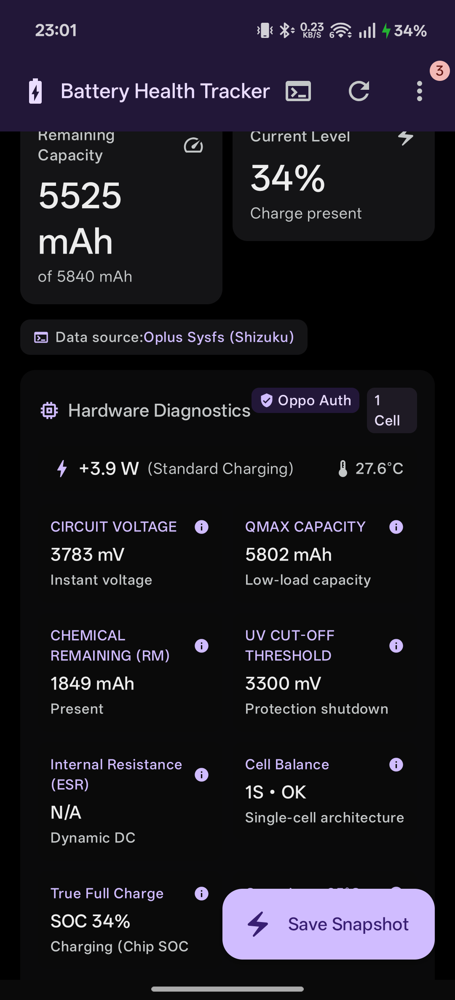</td>
  </tr>
  <tr>
    <td align="center" width="33%"><b>Health Trend & Projection</b></td>
    <td align="center" width="33%"><b>Diagnostic Console</b></td>
    <td align="center" width="33%"><b>Device Presets & Rated mAh</b></td>
  </tr>
  <tr>
    <td>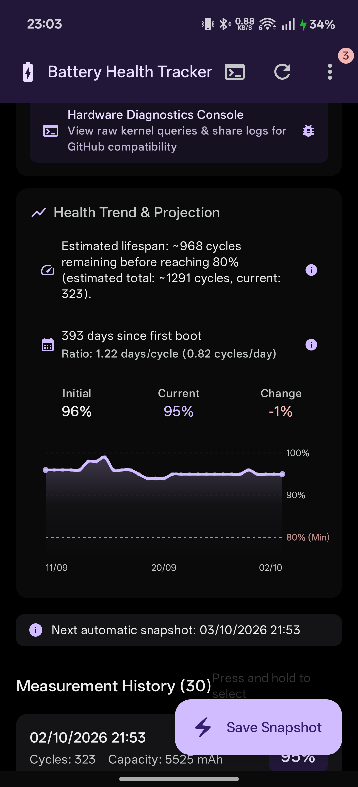</td>
    <td>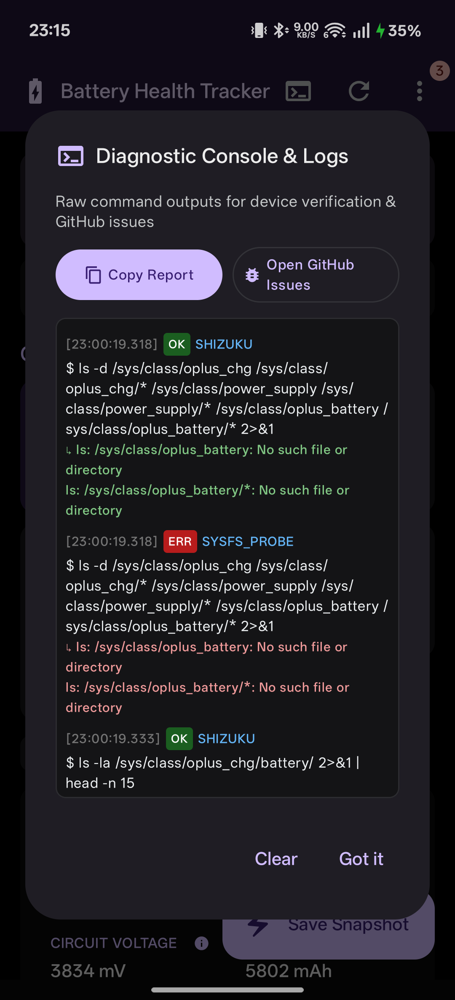</td>
    <td>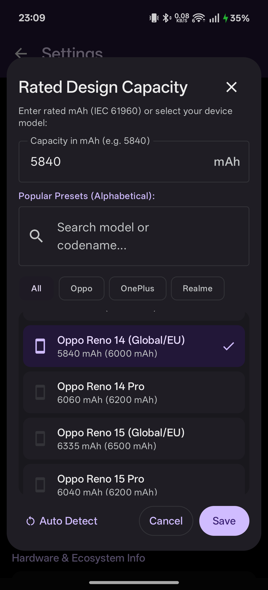</td>
  </tr>
  <tr>
    <td align="center" width="33%"><b>Settings & Updates</b></td>
    <td align="center" width="33%"><b>Theme Settings</b></td>
    <td align="center" width="33%"><b>Trash & Snapshot Bin</b></td>
  </tr>
  <tr>
    <td>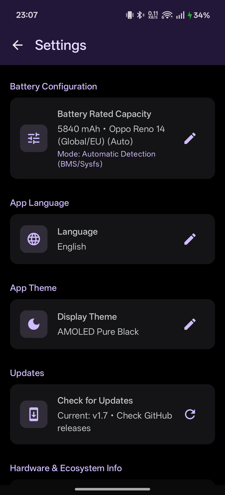</td>
    <td>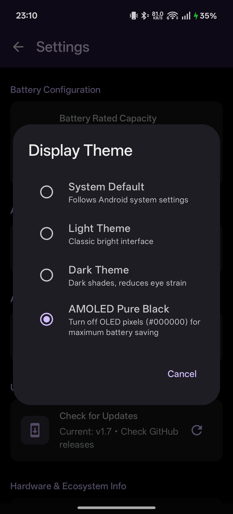</td>
    <td>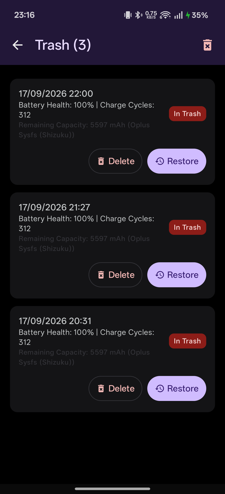</td>
  </tr>
</table>

---

## ✨ Key Features

### 🔬 Low-Level BMS & Kernel Telemetry (via Shizuku)
- **Direct Fuel Gauge Queries:** Reads physical registers directly from `/sys/class/oplus_chg/battery/` and `/sys/class/power_supply/battery/`.
- **True State of Health (SOH):** Real electrochemical capacity evaluated against nominal factory design capacity.
- **Hardware Cycle Counter:** Reads non-volatile cycles tracked by the physical fuel gauge IC (immune to OS battery stat wipes).
- **Dual-Cell SuperVOOC Monitoring:** Individual cell voltages (`cell0Volt`, `cell1Volt`) and series balance $\Delta\text{ mV}$.

### ⚡ True Full Charge vs Display 100%
- **CC/CV Saturation Tracking:** Distinguishes between the display "100%" (often end of Constant Current at ~90% saturation) and **True Full Charge** when Constant Voltage current tapers below cutoff ($I \le 80\text{ mA}$).

### 🌡️ IEC 61960 Thermal Compensation
- **Normalized Capacity at 25°C:** Eliminates seasonal capacity swings (winter vs summer) using the electrochemical standard formula:
  $$C_{25^\circ\text{C}} = \frac{C_{\text{fcc}}}{1.0 + 0.006 \times (T_{\text{batt}} - 25.0)}$$

### 🛡️ Silicon Safety & Protection Registers
- **Hardware Fault Monitoring:** Inspects physical protection flags in real time (`short_c_hw_status`, `short_ic_otp_status`, `subboard_temp_err`) with an instant **SAFE / ALERT** indicator.

### 📈 Internal Resistance (ESR)
- **Dynamic Impedance Calculation:** Estimates real-time internal resistance ($\text{m}\Omega$) using active $\frac{\Delta V}{\Delta I}$ load steps, helping identify aging and degradation.

### 📊 Health Trends & Projections
- **Interactive SOH Chart:** Visual canvas trend with 100%, 90%, and 80% industrial replacement threshold lines.
- **Cycle Life Projection:** Estimates remaining cycles before reaching 80% capacity based on historical wear rate.
- **Safe History Management:** Multi-select deletion, persistent Trash bin, full restore, and bidirectional CSV/JSON export and import with automatic deduplication.

### ⏰ Configurable Background Work Scheduler
- **Customizable Intervals:** Select between **24 hours**, **2 days**, or **7 days** periodic snapshots via Android `WorkManager`.
- **Material 3 TimePicker:** Choose the exact time of day for scheduled background measurements to prevent nighttime wakeups, with real-time countdown banner on the dashboard.

### 📥 CSV History Import & Bidirectional Backup
- **Full History Portability:** Restore snapshots exported from other devices or previous installations.
- **Deduplication & Integrity:** Automatically skips duplicate timestamps while preserving notes and battery metrics.

### 📱 Universal Device Presets & Samsung Galaxy Telemetry
- **OPlus & Samsung Coverage:** Built-in rated capacities (IEC 61960) for 40+ Oppo, Realme, and OnePlus models, plus extensive Samsung Galaxy presets (Galaxy S24, S23, S22, Z Fold/Flip, and A-series).
- **Samsung EFS Telemetry:** Direct decoding of Samsung battery health nodes (`batt_capacity_max`, `batt_discharge_level`, cycle logs), plus platform `power_profile.xml` capacity derivation.

### 🔔 Smart Notifications & Thermal Protection
- **Snapshot Receipts:** Confirmation cards for manual saves, scheduled background logs (`WorkManager`), and 100% charger unplug events.
- **Overheat Alarm:** High-priority alert when battery temperature exceeds 42°C during high-speed charging or heavy workloads.

### 🚀 120 Hz UI & Themes
- **Fluid Performance:** Zero-allocation Composables locked to 120 Hz (8.33 ms frame budget).
- **4 Themes:** System Default, Light, Dark, and AMOLED Pure Black (`#000000`) for zero OLED sub-pixel power draw.

### 💻 Built-in Diagnostic Console
- **Real-Time Shell Inspector:** Live log of every sysfs, dumpsys, and settings query with exit codes and fallback paths.
- **1-Click Bug Reporting:** Instant Markdown generation ready to paste into GitHub Issues.

### 🏷️ SOH Determination Hierarchy
The app clearly indicates how SOH is sourced on your device:
1. **`BMS Hardware / OS`:** Direct read from OEM kernel fuel-gauge registers (ColorOS / OxygenOS / Realme UI certified).
2. **`Calculated SOH`:** Dynamically computed ($\text{FCC} / \text{Typical Capacity} \times 100$) when vendor firmware restricts direct SOH registers.
3. **`Unavailable via API`:** Fallback indicator when running without Shizuku permissions.

### 🌐 Multilingual
- Fully localized in **English**, **Italian (Italiano)**, **Spanish (Español)**, and **French (Français)**.

---

## 🔮 Upcoming Features (Next Release)

The following improvements and capabilities are planned for upcoming releases (**v1.9**):

- **📊 Interactive Home Screen Widget:** Glanceable battery health %, cycle count, and charging wattage on your home screen.
- **TBA**

---

## 📱 Verified Device Battery Database & Hardware Compatibility

> [!IMPORTANT]
> **Compatibility, Community Testing & Diagnostic Logs:**
> - 🟢 **Oppo Reno 14 (EU):** **100% Tested & Verified** working seamlessly via **Shizuku** without root (all BMS telemetry, SOH, FCC, cycle counts, voltage, power, and safety registers read with complete accuracy).
> - 🟢 **Realme GT 7T (EU / RMX5085):** **100% Tested & Verified** working seamlessly via **Shizuku** without root (dynamic fuel-gauge SOH parsing, Qmax 6736 mAh, 259 cycles, dual-cell balance, ESR, production & first use dates).
> - 🟡 **Other Devices (`🤝 Help wanted`):** Due to variations in regional firmware, SELinux enforcement (e.g. OnePlus Nord 5 requiring root for direct Qualcomm sysfs access), and vendor driver differences across ColorOS, OxygenOS, and Realme UI, **full hardware compatibility is not yet guaranteed for other models**.
>   - 📋 **1-Click Markdown Report:** Simply tap **"Copy Report"** in the console to copy your device environment and all raw kernel query outputs to your clipboard.
>   - 🐛 **Standardized Compatibility Form:** Open our dedicated [Device Compatibility Report Form](https://github.com/FrancescoMin/batteryhealthtracker/issues/new?template=device_compatibility.yml) to submit verified metrics with a structured checklist and paste your console logs.
>   - 📖 **Detailed Matrix & Testing Guide:** See [docs/device-compatibility.md](docs/device-compatibility.md) for in-depth testing procedures and architecture details.
>   - Sharing these logs allows us to map missing sysfs nodes, adapt SELinux fallbacks, and certify new devices for the entire community!

| Manufacturer | Model Series | Battery Architecture | Typical / Rated Capacity (mAh) | Compatibility Status | SoC |
| :--- | :--- | :--- | :--- | :--- | :--- |
| **Oppo** | **Reno 14 (EU)** | High-Density Single-Cell | 6000 / 5840 | ✅ **100% Verified (Shizuku)** | MediaTek |
| **Realme** | **GT 7T (EU)** | Dual-Cell Serial | 7000 (2×3500) / 6850 (2×3425) | ✅ **100% Verified (Shizuku)** | MediaTek |
| **OnePlus** | OnePlus 13 | Silicon-Carbon Dual-Cell | 6000 / 5840 | 🧪 Testing / 🤝 Help wanted | Snapdragon |
| **OnePlus** | OnePlus 13R | Silicon-Carbon Dual-Cell | 6000 / 5840 | 🤝 Help wanted | Snapdragon |
| **OnePlus** | OnePlus 15 | Serial Dual-Cell | 7300 (2×3650) / 7150 (2×3575) | 🤝 Help wanted | Snapdragon |
| **OnePlus** | OnePlus 12 / 12R | Dual-Cell Serial | 5400–5500 / 5260–5360 | 🤝 Help wanted | Snapdragon |
| **OnePlus** | OnePlus 11 / 10 Pro | Dual-Cell Serial | 5000 / 4880 | 🤝 Help wanted | Snapdragon |
| **OnePlus** | Nord 5 (Global & India)* | High-Capacity Dual-Cell | 6800 / 6650 | ⚠️ Requires Root (SELinux) | Snapdragon |
| **OnePlus** | Nord 5 (EU/UK)* | Dual-Cell Serial | 5200 / 5200 | 🤝 Help wanted | Snapdragon |
| **OnePlus** | Nord 4 / CE 4 / CE 4 Lite | Dual-Cell Serial | 5500 / 5360 | 🤝 Help wanted | Snapdragon |
| **OnePlus** | Nord 3 | Dual-Cell Serial | 5000 / 4880 | 🤝 Help wanted | MediaTek |
| **OnePlus** | OnePlus Open | Dual-Cell Foldable | 4805 / 4680 | 🤝 Help wanted | Snapdragon |
| **Realme** | GT 8 Pro | Dual-Cell Serial | 7000 (2×3500) / 6850 (2×3425) | 🤝 Help wanted | Snapdragon |
| **Realme** | GT 7 Pro (Global/EU/CN) | Dual-Cell Serial | 6500 (2×3250) / 6310 (2×3155) | 🤝 Help wanted | Snapdragon |
| **Realme** | GT 7 Pro (India) | Dual-Cell Serial | 5800 / 5660 | 🤝 Help wanted |  Snapdragon |
| **Realme** | GT 7 | Dual-Cell Serial | 7000 (2×3500) / 6850 (2×3425) | 🤝 Help wanted | Mediatek |
| **Realme** | GT 6 / GT 6T / GT 5 Pro | Dual-Cell Serial | 5400–5500 / 5260–5360 | 🤝 Help wanted | Snapdragon |
| **Realme** | 14 Pro+ | Silicon-Carbon Single-Cell | 6000 / 5850 | 🤝 Help wanted | Snapdragon |
| **Realme** | 13 Pro+ | High-Density Single-Cell | 5200 / 5050 | 🤝 Help wanted | Snapdragon |
| **Realme** | 12 Pro+ | High-Density Single-Cell | 5000 / 4880 | 🤝 Help wanted | Snapdragon |
| **Oppo** | Find X9 Ultra | High-Density Single-Cell | 7050 / 6890 | 🤝 Help wanted | MediaTek |
| **Oppo** | Find X9 Pro | Silicon-Carbon Dual-Cell | 7500 / 7290 | 🤝 Help wanted | MediaTek |
| **Oppo** | Find X9 | Silicon-Carbon Dual-Cell | 7025 / 6840 | 🤝 Help wanted | MediaTek |
| **Oppo** | Find X8 / X8 Pro | Silicon-Carbon Dual-Cell | 5630–5910 (Typical) | 🤝 Help wanted | MediaTek |
| **Oppo** | Find X7 / X7 Ultra | Dual-Cell Serial | 5000 / 4860–4880 | 🤝 Help wanted | MediaTek |
| **Oppo** | Reno 16 (Global/EU) | High-Density Single-Cell | 6000 / 5820 | 🤝 Help wanted | Snapdragon |
| **Oppo** | Reno 16 (China) | Silicon-Carbon | 6700 / 6490 | 🤝 Help wanted | MediaTek |
| **Oppo** | Reno 15 / 15 Pro | High-Density Single-Cell | 6200–6500 / 6040–6335 | 🤝 Help wanted | MediaTek |
| **Oppo** | Reno 14 Pro | High-Density Single-Cell | 6200 / 6060 | 🤝 Help wanted | MediaTek |
| **Oppo** | Reno 13 | High-Density Single-Cell | 5600 / 5450 | 🤝 Help wanted | MediaTek |
| **Oppo** | Reno 10 Pro / 11 Pro | Dual-Cell Serial | 4600 / 4440 | 🤝 Help wanted | MediaTek |

*Manual rated capacity override is also supported in Settings for custom or unlisted models.*

> [!NOTE]
> \* **OnePlus Nord 5 Root Requirement:** On the OnePlus Nord 5 (CPH2707 / Snapdragon 8s Gen 3), OxygenOS SELinux policies strictly isolate Qualcomm battery sysfs nodes from standard shell access (Shizuku). Direct hardware BMS readings on this model require **Root (`su`) permissions**.

---

## 🛠️ How It Works (Technical Architecture)

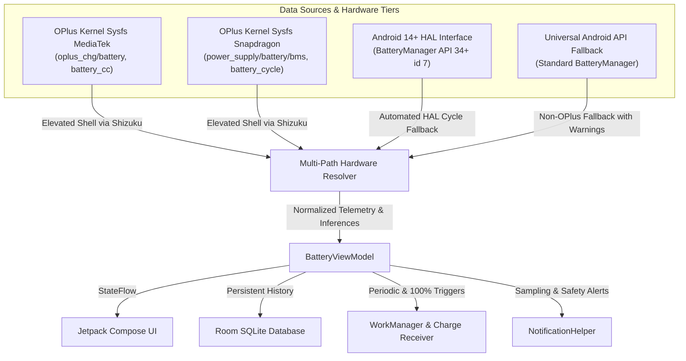
```mermaid
flowchart TD
    subgraph Data Sources & Hardware Tiers
        A1["OPlus Kernel Sysfs MediaTek<br/>(oplus_chg/battery, battery_cc)"]
        A2["OPlus Kernel Sysfs Snapdragon<br/>(power_supply/battery/bms, battery_cycle)"]
        A3["Android 14+ HAL Interface<br/>(BatteryManager API 34+ id 7)"]
        A4["Universal Android API Fallback<br/>(Standard BatteryManager)"]
    end
    
    A1 & A2 -->|Elevated Shell via Shizuku| B[Multi-Path Hardware Resolver]
    A3 -->|Automated HAL Cycle Fallback| B
    A4 -->|Non-OPlus Fallback with Warnings| B
    
    B -->|Normalized Telemetry & Inferences| C[BatteryViewModel]
    C -->|StateFlow| D[Jetpack Compose UI]
    C -->|Persistent History| E[Room SQLite Database]
    C -->|Periodic & 100% Triggers| F[WorkManager & Charge Receiver]
    C -->|Sampling & Safety Alerts| G[NotificationHelper]
```

### Multi-Tiered Hardware Resolution Pipeline

1. **Tier 1: Direct OPlus Kernel Sysfs (via Shizuku)**
   - Automatically adapts between **MediaTek** (`battery_cc`) and **Qualcomm Snapdragon** (`battery_cycle`, `/power_supply/bms/`) nodes within a single low-overhead Binder transaction.
   - Normalizes microampere ($\mu\text{Ah}$) PMIC registers to $\text{mAh}$ and performs bidirectional SOH/FCC inference when nodes are partially restricted.
2. **Tier 2: Android 14+ Hardware HAL Fallback**
   - Automatically queries `BatteryManager.getIntProperty(7)` if vendor SELinux updates isolate custom sysfs cycle nodes.
3. **Tier 3: Universal Android Fallback (Non-OPlus devices)**
   - Graceful fallback for generic hardware with explicit warning badges to ensure instantaneous charge (`CHARGE_COUNTER`) is never confused with chemical health.

---

## 📥 Installation & Setup

> [!TIP]
> **OPPO, Realme & OnePlus Users:** ColorOS, Realme UI, and OxygenOS require a one-time toggle in Developer Options to allow Shizuku shell access (*"The permission of ADB is limited"*).  
> 👉 **Follow our step-by-step fix & language workaround:** [OPPO_REALME_ONEPLUS_SHIZUKU_GUIDE.md](OPPO_REALME_ONEPLUS_SHIZUKU_GUIDE.md)

### Prerequisites
1. **Device:** Oppo, OnePlus, Realme (Android 14+), or any Android 14+ device.
2. **Shizuku:** Installed from [Google Play](https://play.google.com/store/apps/details?id=moe.shizuku.privileged.api) or [GitHub Releases](https://github.com/RikkaApps/Shizuku/releases) and running via **Wireless Debugging** or **Root**.

### App Setup
1. Download and install `BatteryHealthTracker-v1.8.apk` from [Releases](https://github.com/FrancescoMin/batteryhealthtracker/releases).
2. Open the app and grant the **Notification Permission** (required for background snapshot receipts and > 42°C overheat alerts).
3. Tap **"Authorize Shizuku"** and allow access when prompted.
4. Telemetry, health metrics, and hardware registers will populate immediately!

> [!TIP]
> **Keep Background Sampling Active & Avoid Shizuku Reconnections:**  
> If you want automatic periodic measurements (24h background snapshots and 100% full-charge disconnect triggers) to run continuously and want to avoid having to reconnect Shizuku on every app launch, make sure Android does not terminate either process in the background. Exclude **both Battery Health Tracker and Shizuku** from battery optimization (set Battery usage to **"Unrestricted"** / *Senza restrizioni* and allow background activity / auto-launch).  
> *(Per garantire le misurazioni automatiche ed evitare di dover ricollegare Shizuku a ogni accesso, impedisci ad Android di killare i processi in background disattivando l'ottimizzazione batteria sia per l'app sia per Shizuku).*

---

## 🔨 Building from Source

### Requirements
- **JDK 17** or **JDK 21**
- **Android SDK 34** (compileSdk 34)
- **Gradle 8.7+**

### Steps
1. Clone this repository:
   ```bash
   git clone https://github.com/FrancescoMin/batteryhealthtracker.git
   cd batteryhealthtracker
   ```
2. Build the debug APK using Gradle wrapper:
   ```bash
   # On Linux / macOS:
   ./gradlew assembleDebug

   # On Windows (PowerShell):
   .\gradlew.bat assembleDebug
   ```
3. Install directly to your connected device via ADB:
   ```bash
   adb install -r app/build/outputs/apk/debug/app-debug.apk
   ```

---

## 🔒 Privacy, Security & Permissions

- **Transparent Network Usage (`android.permission.INTERNET`):** Used exclusively for the manual in-app update check against official public GitHub Releases (`api.github.com`). Zero background analytics, zero telemetry trackers, zero personal data leaves your device.
- **Transparent Notifications (`POST_NOTIFICATIONS`):** Used strictly for local on-device sampling receipts (manual captures, 24h background sampling, and 100% unplug events) and critical battery overheat alarms (> 42°C). Never used for marketing or background telemetry.
- **Zero Trackers / Telemetry:** No Google Analytics, Firebase, Crashlytics, or third-party advertising SDKs.
- **Local Storage Only:** Historical measurements are stored in a local on-device SQLite database via Android Room.
- **Open Source:** Full source code is open, auditable, and distributed under the Apache-2.0 License.

---

## 🤝 Contributing

Contributions, device profile additions, translations, and feature suggestions are welcome!

### 📱 Device Testing & Verification
Do you own any of the devices marked as **`🤝 Help wanted`** in the [Hardware Compatibility Table](#-verified-device-battery-database--hardware-compatibility)?  
**Testing the app on your device is warmly encouraged and greatly appreciated!**
- Install the app and grant access via [Shizuku](https://shizuku.rikka.app/) (no root required for most devices).
- Verify if real-time hardware telemetry (SOH, capacity, cycle count, temperature, voltage) is extracted accurately.
- Share your findings or report any anomalies using our [Device Compatibility Report Form](https://github.com/FrancescoMin/batteryhealthtracker/issues/new?template=device_compatibility.yml) or open a [GitHub Issue](https://github.com/FrancescoMin/batteryhealthtracker/issues).

### 💻 Code & Preset Contributions
1. Fork the project.
2. Create your feature branch (`git checkout -b feature/NewDevicePreset`).
3. Commit your changes (`git commit -m "Add verified battery preset for Device X"`).
4. Push to the branch (`git push origin feature/NewDevicePreset`).
5. Open a Pull Request.

---

## ⚖️ Disclaimer & Accuracy Notice

Battery Health Tracker is an independent diagnostic utility for monitoring and personal reference.
- **Non-Official:** This project is not affiliated with, endorsed by, or certified by Oppo, OnePlus, Realme, or BBK Electronics. It must not be confused with official manufacturer service tools or warranty inspection software.
- **Sensor & Firmware Tolerances:** Telemetry is read directly from kernel sysfs nodes and fuel-gauge registers via Shizuku. Reported metrics (SOH %, capacity, cell resistance) may fluctuate depending on operating temperature, OEM firmware revisions, and sensor calibration.

---

## 📄 License

Distributed under the **Apache License, Version 2.0**. See `LICENSE` for more information.

---

<p align="center">
  <sub>Built with ❤️ for Android enthusiasts, battery health purists, and the Shizuku community.</sub>
</p>
